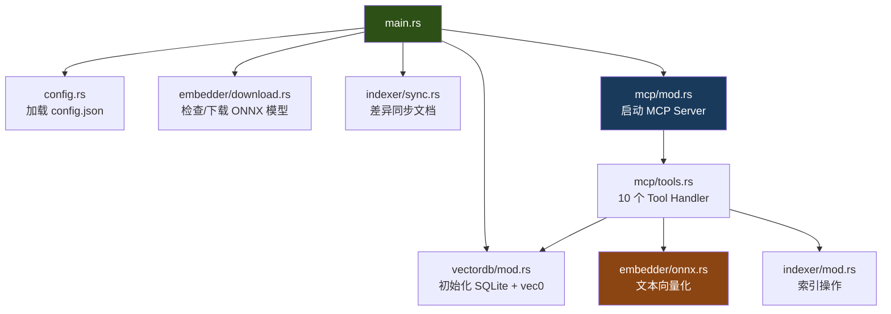
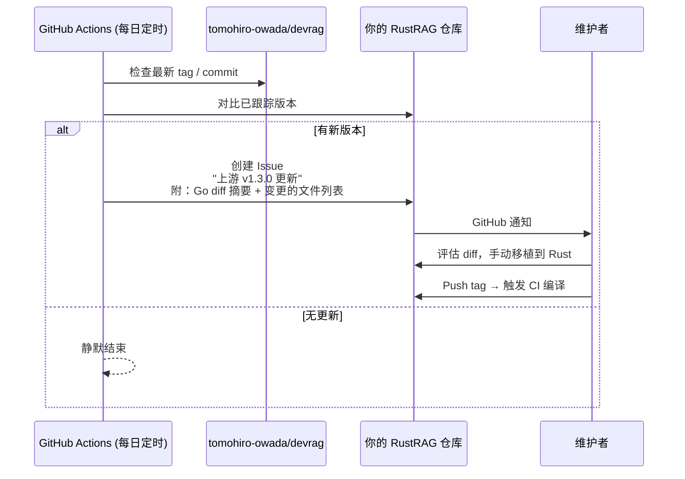

# RustRAG 设计文档

> **状态**: 待用户审批

## 1. 目标

将 [DevRag](https://github.com/tomohiro-owada/devrag)（Go 实现的本地 RAG MCP Server）完整移植为 Rust 实现，并建立 GitHub Actions 工作流半自动跟踪上游更新。

---

## 2. 用户需求拆解

| 需求                    | 说明                                                |
| ----------------------- | --------------------------------------------------- |
| **R1: 全 Rust 重写**    | 完整替换 Go 代码库，功能 1:1 对等                   |
| **R2: 相同的 MCP 接口** | 10 个 Tool 的名称、参数、返回值保持完全一致         |
| **R3: 跨平台编译**      | macOS (Intel/ARM), Linux (x64/ARM64), Windows (x64) |
| **R4: 上游跟踪**        | 检测原项目更新，生成 Issue 通知，辅助移植           |
| **R5: 自动 CI/CD**      | Push 后自动多平台编译 + GitHub Release              |

---

## 3. 方案探索

### 方案 A：完整 Rust 重写 + 上游监控 Issue Bot（推荐 ✅）

- 一次性将 5 个模块全部用 Rust 重写
- GitHub Actions 每日检查上游新 Release/commit，自动创建 Issue 附 diff
- 人工评估并手动移植有意义的改动
- Push tag 后自动触发 5 平台编译 + Release

**优点**: 代码库完全独立，架构自由度最高，可引入 Go 版没有的优化（batch embedding、async 等）
**缺点**: 初始投入最大，后续维护需持续关注上游

### 方案 B：Rust FFI 包装 Go 代码

- 将 Go 代码编译为 C-shared library，Rust 通过 FFI 调用
- 只用 Rust 写 MCP 层和 main

**优点**: 最小改动
**缺点**: 完全违背 Rust 化的初衷，引入双语言复杂度，**不推荐**

### 方案 C：渐进式替换（先 Rust 写新模块，Go 保留旧模块）

- 通过 IPC 让 Rust 和 Go 进程协作
- 逐步替换

**优点**: 风险分散
**缺点**: 两个进程通信增加复杂度，对 MCP stdio 模式有冲突，**不推荐**

### 🎯 推荐：方案 A

理由：DevRag 总代码量仅约 3000-4000 行 Go，Rust 重写完全可控。方案 B/C 引入的复杂度远超一次性重写。

---

## 4. 技术架构

### 4.1 项目结构

```
RustRAG/
├── Cargo.toml                  # Workspace root
├── src/
│   ├── main.rs                 # 入口：配置加载 → 模型下载 → DB初始化 → 同步 → MCP启动
│   ├── config.rs               # 配置管理（serde_json 反序列化）
│   ├── embedder/
│   │   ├── mod.rs              # Embedder trait 定义
│   │   ├── onnx.rs             # OnnxEmbedder（ort crate）
│   │   ├── mock.rs             # MockEmbedder（测试用）
│   │   ├── download.rs         # 模型自动下载（reqwest）
│   │   └── tokenizer.rs        # BERT tokenizer（tokenizers crate）
│   ├── vectordb/
│   │   ├── mod.rs              # DB struct + 初始化
│   │   ├── schema.rs           # 建表 SQL
│   │   ├── operations.rs       # CRUD 操作
│   │   └── search.rs           # 向量搜索（sqlite-vec）
│   ├── indexer/
│   │   ├── mod.rs              # Indexer struct
│   │   ├── markdown.rs         # Markdown 解析 + 分块（pulldown-cmark）
│   │   ├── code.rs             # 代码解析（tree-sitter）
│   │   ├── chunk.rs            # CodeChunk 数据结构
│   │   ├── sync.rs             # 差异同步
│   │   ├── languages.rs        # 语言特定 TS Query
│   │   ├── relations.rs        # 代码关系提取
│   │   └── dictionary.rs       # 多语言词典
│   ├── mcp/
│   │   ├── mod.rs              # MCP Server 初始化
│   │   └── tools.rs            # 10 个 Tool handler
│   ├── updater.rs              # 版本更新检查
│   └── frontmatter.rs          # YAML frontmatter 解析
├── tests/
│   ├── integration_test.rs     # 端到端测试
│   └── ...
├── .github/
│   └── workflows/
│       ├── ci.yml              # PR/Push 自动测试
│       ├── release.yml         # Tag 触发多平台编译 + Release
│       └── upstream-watch.yml  # 上游监控 + Issue 创建
└── docs/
    ├── devrag_rust_analysis.md # 可行性分析报告
    └── plans/                  # 设计与计划文档
```

### 4.2 核心依赖 (Cargo.toml)

```toml
[dependencies]
# ONNX 推理
ort = { version = "2", features = ["download-binaries"] }
ndarray = "0.16"

# SQLite + 向量搜索
rusqlite = { version = "0.32", features = ["bundled"] }
sqlite-vec = "0.1"

# MCP 协议
rust-mcp-sdk = "0.8"          # 或 mcp-protocol-sdk
tokio = { version = "1", features = ["full"] }

# Tokenizer
tokenizers = "0.20"

# AST 解析
tree-sitter = "0.24"
tree-sitter-go = "0.23"
tree-sitter-python = "0.23"
tree-sitter-typescript = "0.23"
tree-sitter-javascript = "0.23"

# Markdown 解析
pulldown-cmark = "0.12"

# 序列化/配置
serde = { version = "1", features = ["derive"] }
serde_json = "1"

# HTTP (模型下载)
reqwest = { version = "0.12", features = ["blocking", "stream"] }

# 工具
bytemuck = { version = "1", features = ["derive"] }
glob = "0.3"
thiserror = "2"
tracing = "0.1"
tracing-subscriber = "0.3"
clap = { version = "4", features = ["derive"] }
```

### 4.3 模块间数据流



### 4.4 与 Go 版本的对等映射

| Go 模块                          | Go 文件 | Rust 模块                   | 核心差异                                        |
| -------------------------------- | ------- | --------------------------- | ----------------------------------------------- |
| `cmd/main.go`                    | 122行   | `src/main.rs`               | 使用 `clap` 替代 `flag`；`tokio::main` 异步入口 |
| `internal/config/`               | ~150行  | `src/config.rs`             | 使用 `serde` derive 宏，无需手动解析            |
| `internal/embedder/onnx.go`      | 271行   | `src/embedder/onnx.rs`      | `ort` 零成本 FFI；`ndarray` 替代手写数学        |
| `internal/embedder/download.go`  | 130行   | `src/embedder/download.rs`  | `reqwest` 替代 `net/http`；带进度条             |
| `internal/embedder/tokenizer.go` | ~200行  | `src/embedder/tokenizer.rs` | HuggingFace 官方 `tokenizers` crate             |
| `internal/vectordb/db.go`        | 621行   | `src/vectordb/*.rs`         | `rusqlite` + `bytemuck` 零拷贝向量序列化        |
| `internal/indexer/code.go`       | 305行   | `src/indexer/code.rs`       | Tree-sitter 官方 Rust crate                     |
| `internal/indexer/markdown.go`   | ~200行  | `src/indexer/markdown.rs`   | `pulldown-cmark` 纯 Rust                        |
| `internal/indexer/sync.go`       | 131行   | `src/indexer/sync.rs`       | 逻辑完全对等                                    |
| `internal/mcp/tools.go`          | 820行   | `src/mcp/tools.rs`          | Rust MCP SDK；`?` 操作符减少 30% 样板           |
| `internal/mcp/server.go`         | 68行    | `src/mcp/mod.rs`            | Tokio async                                     |

### 4.5 上游跟踪机制



---

## 5. 关键设计决策

| 决策点     | 选择                                      | 理由                                                      |
| ---------- | ----------------------------------------- | --------------------------------------------------------- |
| 异步运行时 | Tokio                                     | MCP SDK 和 reqwest 都基于 Tokio                           |
| 错误处理   | `thiserror` (库层) + `anyhow` (main)      | 标准 Rust 最佳实践                                        |
| 日志       | `tracing` + `tracing-subscriber` (stderr) | 替代 Go 的 `fmt.Fprintf(os.Stderr, ...)`                  |
| CLI 参数   | `clap` derive                             | 替代 Go 的 `flag`                                         |
| MCP SDK    | 需调研确认最终选择                        | `rust-mcp-sdk` 或 `mcp-protocol-sdk`，取决于 stdio 支持度 |
| 向量序列化 | `bytemuck::cast_slice`                    | 零拷贝，编译期安全                                        |

---

## 6. 验证策略

| 验证层       | 方法                                                |
| ------------ | --------------------------------------------------- |
| **单元测试** | 每个模块独立测试（`cargo test`）                    |
| **集成测试** | 模拟 MCP JSON-RPC 请求，验证搜索/索引完整流程       |
| **对等测试** | 对同一文档同时用 Go 版和 Rust 版索引+搜索，对比结果 |
| **交叉编译** | GitHub Actions matrix 策略，5 平台编译通过          |
| **上游跟踪** | 手动触发 `upstream-watch.yml`，验证 Issue 自动创建  |
